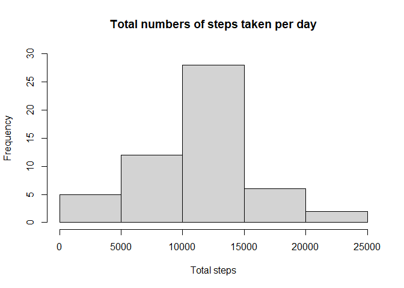
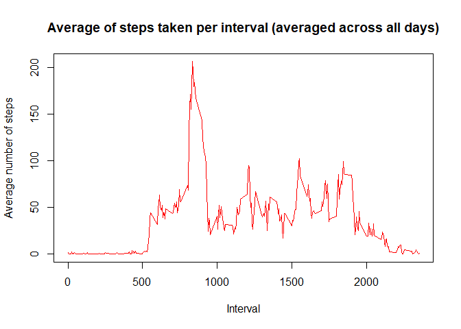
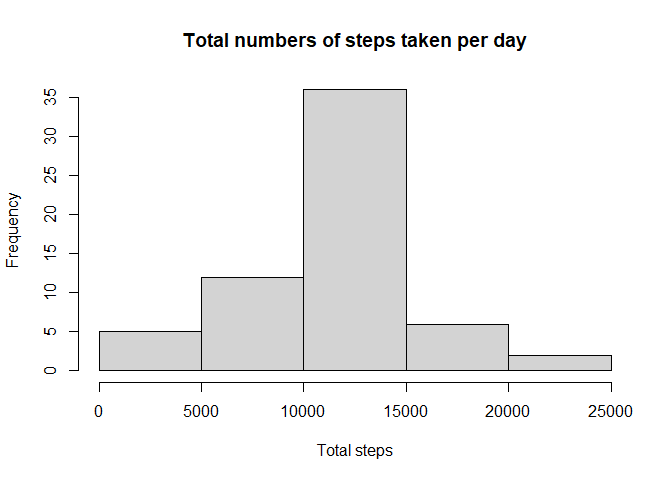
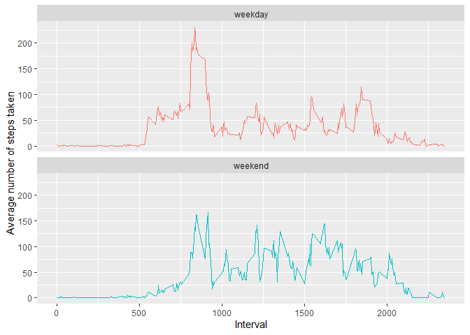

# Course Project 1

It is now possible to collect a large amount of data about personal movement using activity monitoring devices such as a Fitbit, Nike Fuelband, or Jawbone Up. These type of devices are part of the “quantified self” movement – a group of enthusiasts who take measurements about themselves regularly to improve their health, to find patterns in their behavior, or because they are tech geeks. But these data remain under-utilized both because the raw data are hard to obtain and there is a lack of statistical methods and software for processing and interpreting the data.

This assignment makes use of data from a personal activity monitoring device. This device collects data at 5 minute intervals through out the day. The data consists of two months of data from an anonymous individual collected during the months of October and November, 2012 and include the number of steps taken in 5 minute intervals each day.

The data for this assignment can be downloaded from the course web site:

- Dataset: [Activity monitoring data](https://d396qusza40orc.cloudfront.net/repdata%2Fdata%2Factivity.zip)  [52K]

The variables included in this dataset are:

- steps: Number of steps taking in a 5-minute interval (missing values are coded as NA)
- date: The date on which the measurement was taken in YYYY-MM-DD format
- interval: Identifier for the 5-minute interval in which measurement was taken

## Loading and preprocessing the data

Before anything, we should load the packages we will use in this assignment.


```r
library(dplyr)
library(ggplot2)
```
Assuming the zip folder containing the data (in a csv file) has been download and unzipped in the
working directory, the following code will read in the data. 


```r
data <- read.csv("activity.csv", header = TRUE)
```

We then explore the data a little bit.


```r
summary(data)
```

```
##      steps            date              interval     
##  Min.   :  0.00   Length:17568       Min.   :   0.0  
##  1st Qu.:  0.00   Class :character   1st Qu.: 588.8  
##  Median :  0.00   Mode  :character   Median :1177.5  
##  Mean   : 37.38                      Mean   :1177.5  
##  3rd Qu.: 12.00                      3rd Qu.:1766.2  
##  Max.   :806.00                      Max.   :2355.0  
##  NA's   :2304
```

We should transform the dates of the date column into a date class recognized by R, because currently they are characters. This is the only processing needed by this data set.


```r
data$date <- as.POSIXct(data$date)
```

## What is mean total number of steps taken per day?

Grouping the data by date, we can calculate the total number of steps taken by day. We will ignore the missing values for the time being. The following code will calculate the total number of steps taken by day and it will ignore (remove) any NA from the calculations.

[Note: Another method of removing the NAs (adding 'na.rm=TRUE' as an argument of the sum function) will not actually remove them (taking them out of the calculations), but will replace any NA with 0, thus skewing any calculation we make toward 0.]


```r
stepsxday <- filter(data, !is.na(steps)) %>%
    group_by(date) %>%
    summarize(steps = sum(steps))
head(stepsxday)
```

```
## # A tibble: 6 x 2
##   date                steps
##   <dttm>              <int>
## 1 2012-10-02 00:00:00   126
## 2 2012-10-03 00:00:00 11352
## 3 2012-10-04 00:00:00 12116
## 4 2012-10-05 00:00:00 13294
## 5 2012-10-06 00:00:00 15420
## 6 2012-10-07 00:00:00 11015
```

With the total number of steps taken by day calculated, we can now create a histogram.

```r
hist(stepsxday$steps, breaks = seq(0, 25000, by = 5000), 
     main = "Total numbers of steps taken per day", 
     xlab = "Total steps", ylim=c(0, 30))
```

<!-- -->

The mean of the total number of steps taken per day is calculated as follows.

```r
mean(stepsxday$steps)
```

```
## [1] 10766.19
```

The median of the total number of steps taken per day is calculated as follows.

```r
median(stepsxday$steps)
```

```
## [1] 10765
```

## What is the average daily activity pattern?

We will calculate the average number of steps taken by interval, averaged across all the days of the dataset.

```r
stepsperinterval <- group_by(data, interval) %>%
  summarise(steps=mean(steps, na.rm = TRUE))
```

Now we can draw a time series plot of the 5-minute interval and the number of steps taken, averaged across all days.

```r
plot(stepsperinterval$interval, stepsperinterval$steps, type="l", col = "red",
     ylab = "Average number of steps", xlab = "Interval",
     main = "Average of steps taken per interval (averaged across all days)")
```

<!-- -->

The 5 minute interval that contains the most steps, on average across all days, is the 835 interval, according the code below.

```r
stepsperinterval[which.max(stepsperinterval$steps),1]
```

```
## # A tibble: 1 x 1
##   interval
##      <int>
## 1      835
```


## Imputing missing values

The dataset has several missing values in the steps column. In total, there are 2304 missing values, which represent some 13% of the data in the steps column.

```r
sum(is.na(data$steps))
```

```
## [1] 2304
```

```r
mean(is.na(data$steps))
```

```
## [1] 0.1311475
```

As the presence of missing values in our dataset may introduce bias into some calculations and make others impossible, they need to be replaced. To keep things simple, we will replace the missing values with the mean of steps taken according to each of the missing values' interval.
A new dataset will be created with the imputed missing values.

```r
datacomplete <- data
i <- 0
for (i in 1:nrow(datacomplete)){
  if(is.na(datacomplete[i,1]))
    {
    datacomplete[i,1] <- stepsperinterval[stepsperinterval[,1] == 
                                            datacomplete[i,3],2]
  }
}
summary(datacomplete)
```

```
##      steps             date                        interval     
##  Min.   :  0.00   Min.   :2012-10-01 00:00:00   Min.   :   0.0  
##  1st Qu.:  0.00   1st Qu.:2012-10-16 00:00:00   1st Qu.: 588.8  
##  Median :  0.00   Median :2012-10-31 00:00:00   Median :1177.5  
##  Mean   : 37.38   Mean   :2012-10-30 23:32:27   Mean   :1177.5  
##  3rd Qu.: 27.00   3rd Qu.:2012-11-15 00:00:00   3rd Qu.:1766.2  
##  Max.   :806.00   Max.   :2012-11-30 00:00:00   Max.   :2355.0
```

A histogram of the total number of steps taken by day is drawn from the new dataset with no missing values.

```r
stepsxdaycomplete <- group_by(datacomplete, date) %>%
  summarise(steps=sum(steps, na.rm=TRUE))
hist(stepsxdaycomplete$steps, breaks = seq(0, 25000, by = 5000), 
     main = "Total numbers of steps taken per day", 
     xlab = "Total steps")
```

<!-- -->

The mean and the median of the total number of steps taken by day is calculated.

```r
mean(stepsxdaycomplete$steps)
```

```
## [1] 10766.19
```

```r
median(stepsxdaycomplete$steps)
```

```
## [1] 10766.19
```

There is no difference between the mean calculated after imputing the NA values and the mean calculated with the original data. This is not surprising because the original mean calculation removed any NA value and the missing values were imputed with the mean number of steps per interval.
The median has increased just a little bit, from 10765, because more values are present in the imputed dataset, but they are not of great magnitudes.

## Are there differences in activity patterns between weekdays and weekends?

First, we will create a factor variable in the dataset with filled in NAs. This factor variable will have two levels (weekday/weekend) to indicate whether a given date is a weekday or a weekend day.

```r
daysofweek <- c('lunes', 'martes', 'miércoles', 'jueves', 'viernes')
i <- 0
for(i in 1:nrow(datacomplete)){
  if(weekdays(as.POSIXct(datacomplete[i,2])) %in% daysofweek){
    datacomplete[i,4] <- 0
  } else{
    datacomplete[i,4] <- 1
  }
}
colnames(datacomplete)[4] <- 'day'
datacomplete[,4] <- factor(datacomplete[,4], labels = c('weekday', 'weekend'))
head(datacomplete)
```

```
##       steps       date interval     day
## 1 1.7169811 2012-10-01        0 weekday
## 2 0.3396226 2012-10-01        5 weekday
## 3 0.1320755 2012-10-01       10 weekday
## 4 0.1509434 2012-10-01       15 weekday
## 5 0.0754717 2012-10-01       20 weekday
## 6 2.0943396 2012-10-01       25 weekday
```

Now, we will make a panel plot containing a time series plot (i.e. 𝚝𝚢𝚙𝚎 = “𝚕”) of the 5-minute interval (x-axis) and the average number of steps taken, averaged across all weekday days or weekend days (y-axis).

```r
totalsteps_day <- group_by(datacomplete, day, interval) %>%
  summarise(steps=mean(steps, na.rm = TRUE))
```

```
## `summarise()` regrouping output by 'day' (override with `.groups` argument)
```

```r
ggplot(data = totalsteps_day, aes(x = interval, y = steps, color = day)) +
  geom_line() +
  labs(x = "Interval", y = "Average number of steps taken") +
  facet_wrap( ~ day, ncol = 1, nrow = 2) +
  theme(legend.position = "none")
```

<!-- -->
